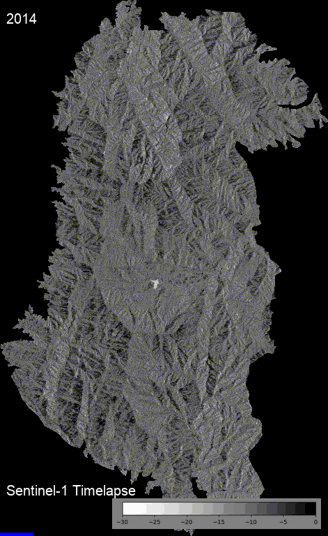
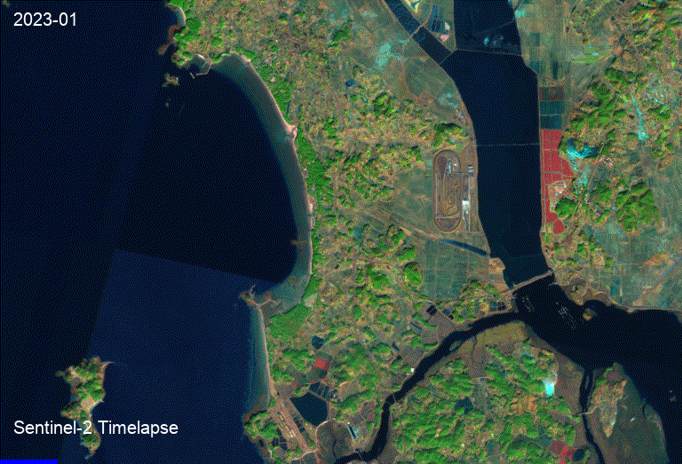

# 'Eye of Bandal' Korean National Park AI Solution Service
### Sentinel Satellite Based Nature Change Detection Platform 
#### Using Geemap 

  

### Function
#### Satellite Based Change Detection
- Environmental Management
   1. Timelapse
  

  
  

  
  

    
    
  

  
   2. Surface Change Detection
   

  
  

- Resource Monitoring
   1. Vegetation Index Analysis/Prediction
  

  
  

     
   2. Soil Profiling(Component Content/Moisture Content)
  

  
  

  
   3. Water Resource Management(Precipitation/Groundwater Recharge Rate)
  

  
  

  
- Disaster/Safety
   1. Landslide vulnerability Map(of South Korea) / Landslide Predict modeling(LPM)
  

  
  

  
### How to run

### Tool
- Language : Python
- AI Model : Prophet(Meta), Google Earth Engine Classifier
- Web : Streamlit

### Development Period
- Ver.1 : 2023.10.20 ~ 2023.11.29
- Ver.2 : 2023.11.30 ~ 2023.12.20

### Contributor
<table>
  <tr>
    <!-- first -->
    <td align="center">
      <a href="https://github.com/anijiho">
         
        <b>Jiho An</b>
      </a>
    </td>
    <!-- second -->
    <td align="center">
      <a href="https://github.com/hyejoony">
         
        <b>Hye-joon Jeon</b>
      </a>
    </td>
    <!-- third -->
    <td align="center">
      <a href="https://github.com/Hipposdata">
         
        <b>Jeongmin Ha</b>
      </a>
    </td>
    <!-- fourth -->
    <td align="center">
      <a href="https://github.com/2dohyeon">
         
        <b>Do-hyeon Lee</b>
      </a>
    </td>
    <!-- fifth -->
    <td align="center">
      <a href="https://github.com/yebeenshin">
         
        <b>Ye-been Shin</b>
      </a>
    </td>
 <!-- sixth -->
    <td align="center">
      <a href="https://github.com/osgeokr">
         
        <b>Byeong-Hyeok Yu</b>
      </a>
    </td>
  </tr>
</table>

### Especially Thanks to
- Byeong-Hyeok Yu
- Crego, R. D., Stabach, J. A., & Connette, G.
#### for sharing the great resource(code) online :)

